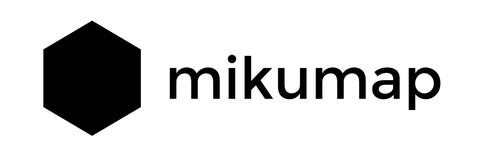

# mikumap

{: width="300"}

## 機能
- ノードにコメントをつなげられる
- ノードはアクティブになったら中央によってくる
- 物理演算でノード感の距離は良い感じになる
- 他のユーザーがつけたコメントをリアルタイムに反映
- 距離の遠いノードにはfogをかける
- 部屋をURLのハッシュ値で分割可能で、同時にデータストアも分割している
- roomsの情報を一覧できる
- デザインがミクっぽい

## 使い方
- [] [milkcocoa](mlkcca.com)でappを作ってappidをjs/mikumap.jsの最初の行に入れる
- [] とりあえず[bitbaloon](https://www.bitballoon.com/)でホスティングする。でもmilkcocoa hostingももうすぐ出るよ。
- [] 自分なりに改造してみよう！
